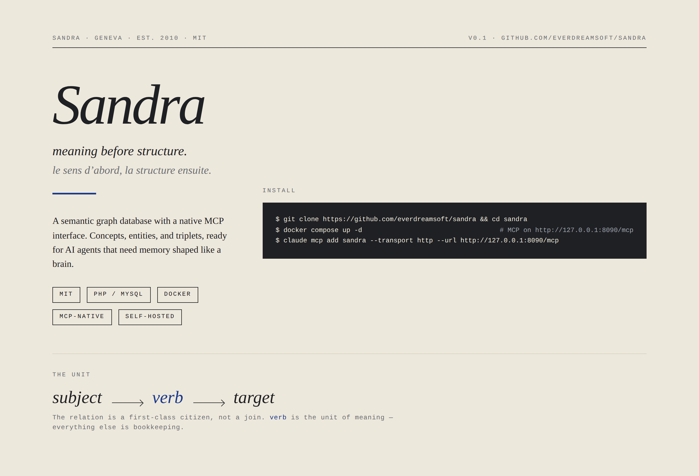

<p align="center">
    
</p>

<p align="center">
    Self-hostable graph + vector memory. Native MCP. <strong>0.89</strong> on
    <a href="https://github.com/everdreamsoft/structured-recall-bench">Structured Recall Bench</a>,
    where vector stores cluster between 0.25 and 0.48.
</p>

<p align="center">
    <a href="#install"></a>
    <a href="https://sandraeds.everdreamsoft.com"></a>
    <a href="https://discord.gg/9ptCvXJzy"></a>
</p>

<p align="center">
    <a href="https://github.com/everdreamsoft/structured-recall-bench">
        
    </a>
</p>

---

Every AI agent forgets. Vector memory finds similar text but can't enumerate or relate. Classical graph DBs use free-form labels that no LLM can read. SaaS memory ships your data to someone else's servers.

Sandra is a self-hostable graph + vector memory layer where every concept (verb, label, category) has a unique ID and a human-readable name. Your agents read, write, and reason over a *shared lexicon*. Every relationship is an explicit synapse you can trace. Exposed natively via MCP, so any LLM that can call a tool can use it.

## Install

```bash
git clone https://github.com/everdreamsoft/sandra && cd sandra
docker compose up -d                                   # MCP on http://127.0.0.1:8090/mcp
claude mcp add sandra --transport http --url http://127.0.0.1:8090/mcp
```

That's it — your agent now has persistent memory across sessions, projects, machines, and clients (Claude, GPT, Gemini, Llama, Mistral...).

<details>
<summary>Other clients · semantic search · claude.ai web (HTTPS) · from source</summary>

```bash
cp .env.example .env                          # set OPENAI_API_KEY for semantic search
docker compose --profile tunnel up -d         # public HTTPS via trycloudflare for claude.ai
docker compose logs tunnel | grep trycloudflare
```

Cursor, Cline, Continue, Zed, OpenAI Agents SDK, custom clients: point your client's MCP server config at `http://127.0.0.1:8090/mcp`. From source (PHP 8+, MySQL, composer): see [Install Sandra](https://sandraeds.everdreamsoft.com/getting-started-installation). Set `SANDRA_AUTH_TOKEN` in `.env` before exposing the trycloudflare URL — it is public.

</details>

Full setup, OAuth 2.1/PKCE, auth tokens: [Install Sandra](https://sandraeds.everdreamsoft.com/getting-started-installation). MCP tool reference: [mcp overview](https://sandraeds.everdreamsoft.com/mcp-overview). Live quickstart and demos: [sandraeds.everdreamsoft.com](https://sandraeds.everdreamsoft.com). Questions? [Join the Discord](https://discord.gg/9ptCvXJzy).

## What recall feels like

```text
─ Monday, ChatGPT on the web ─
You:    CSV of 100 tweets I wrote this year (text, likes, replies).
        Save them in Sandra and tag each with its emotional register.
Agent:  [sandra_batch → 100 tweet entities; refs: text, engagement,
                       emotion (awe / pride / frustration / joy / ...)]

─ Wednesday, Claude Code on your laptop ─
You:    Design a landing page that resonates with the emotions my
        audience reacts to most.
Agent:  [sandra_search → emotion breakdown, weighted by engagement]
        Your audience peaks on awe and pride. Drafting a hero in that
        register, plus a social-proof block citing your three
        highest-engagement tweets...
```

Memory lives in *your* Sandra instance, not in any model's context window. Switch models, switch clients, switch machines: the memory stays.

> *The next generation of software will be written by agents that need memory like ours.*
>

## Why Sandra

Current market solutions are not able to retrieve all the data correctly, so it is impossible to trust agents with precise tasks. Here is how they compare.

| Approach              | Example                | SRB composite | Trade-off                                     |
|-----------------------|------------------------|---------------|-----------------------------------------------|
| Vector retrieval      | Mem0, Zep, Supermemory | 0.25 to 0.33  | Finds similar text, can't enumerate or relate |
| Verbatim retrieval    | MemPalace              | 0.48          | A static memory palace, no associative recall |
| Classical graph DB    | Neo4j, TigerGraph      | (no provider) | Free-form labels, unreadable for LLMs         |
| **Sandra + planner**  | this repo              | **0.89**      | Graph + vector + shared LLM-readable lexicon  |

130 deterministic questions, no LLM-judge, raw responses archived. Full design rationale: [Sandra memory design](https://sandraeds.everdreamsoft.com/concepts-memory-design).

**Sandra is for you if** you want your agent to remember across sessions and machines, you want to own the data, you build with multiple LLMs, or you need explicit relationships — not fuzzy similarity. **Skip Sandra if** you need a transactional database (use Postgres), pure vector retrieval at massive scale (use a dedicated vector store), or zero infrastructure (use a hosted service).

## How memory works

Four primitives, mapped to what neurons do.

- **Concept** — a stable, named ID; the *neuron* (`likes`, `works_at`, `user`).
- **Triplet** — a `(subject, verb, target)` link; the *synapse*.
- **Entity** — a typed cluster of refs grouped by a factory; a *named region*.
- **Factory** — the schema for an entity cluster (`person`, `product`, `task`).

DB analog: concepts are *words*, entities are *rows*, factories are *tables*, triplets are *sentences*.

```
─── THE UNIT ─────────────────────────────

   Alice ──── likes ──────▶ strawberry
     │
     └─── works_with ─────▶ Bob

   subject     verb            target
```

Encounter `Alice`, Sandra activates that node and follows every synapse outward in one query — *spreading activation* ([Collins & Loftus, 1975](https://doi.org/10.1037/0033-295X.82.6.407)), the mechanism behind associative human recall. Because every concept is a stable, named ID, an LLM can call `sandra_list_concepts` and read the entire vocabulary. No schema file, no documentation needed.

### One concept, many implementations

A concept's identity is stable, but the attributes attached to it can vary by source. `Concept(user)` keeps a single ID across every system that talks about it:

```
Concept(user)
  ─ in_system → marketing_db    refs: { name: "User",      ltv: 4200, segment: "enterprise" }
  ─ in_system → auth_service    refs: { name: "Principal", email: "alice@acme.com", mfa: true }
  ─ in_system → support_crm     refs: { name: "Customer",  tier: "gold", open_tickets: 2 }
```

This is what philosophers [since Frege](https://en.wikipedia.org/wiki/Sense_and_reference) have called *invariance of reference under variation of sense*. What programmers call polymorphism. What your agents need so they can answer "show me everything we know about this user" without lying, conflating, or losing source attribution.

Building a multi-agent system? Every agent is itself an entity in the same graph it reads from. Pattern + comparison with CrewAI / LangGraph / OpenAI Assistants in [Guides - multi-agent](https://sandraeds.everdreamsoft.com/guides-multi-agent).

## Beyond agent memory

Same primitives also handle:

- **Personal knowledge management**: Stash articles, strategy notes, ideas as typed entities. Ask: "Give me the 10 most-engaging emotional tweets I posted; suggest an eleventh."
- **Relationship CRM**: Track who covered you, who knows whom, who said what. "Which journalists wrote about us this year? Who at TechCrunch?"
- **Headless CMS for LLM-driven apps**: Expose Sandra over the REST API + a thin UI; let agents update content from natural language. "Change the price of the Geneva listing to 350."
- **Lightweight analytics**: Log who-viewed-what as triplets, query later via the same MCP tools. "Which cards got the most attention from European visitors last week?"

Switching frame is a query, not a migration.

## Building on Sandra

- **PHP SDK** — `composer require everdreamsoft/sandra` [php sdk](https://sandraeds.everdreamsoft.com/sdk-overview)
- **REST API** — language-agnostic [sdk rest api](https://sandraeds.everdreamsoft.com/sdk-rest-api)
- **Python and TypeScript SDKs** — coming

```php
<?php
use SandraCore\System;
use SandraCore\EntityFactory;

$sandra = new System('myapp', true, 'localhost', 'sandra', 'root', '');
$people = new EntityFactory('person', 'peopleFile', $sandra);

$alice = $people->createNew(['name' => 'Alice', 'role' => 'founder']);
$bob   = $people->createNew(['name' => 'Bob',   'role' => 'engineer']);
$alice->setJoinedEntity('works_with', $bob, ['since' => '2024']);
```

Longer walkthrough: [`docs/code-samples/animal-shelter.php`](docs/code-samples/animal-shelter.php).

## Documentation

| Guide | What it covers |
|---|---|
| [Install Sandra](https://sandraeds.everdreamsoft.com/getting-started-installation) | Sandra + MCP server + your MCP client |
| [mcp overview](https://sandraeds.everdreamsoft.com/mcp-overview) | MCP server reference: tools, configuration, custom tools |
| [sdk rest api](https://sandraeds.everdreamsoft.com/sdk-rest-api) | REST API and PHP SDK |
| [`agent-memory-design.md`](docs/agent-memory-design.md) | Why Sandra is shaped the way it is |

## Community & Status

Join the conversation on [Discord](https://discord.gg/9ptCvXJzy). Live quickstart at [sandraeds.everdreamsoft.com](https://sandraeds.everdreamsoft.com).

Used in production at [EverdreamSoft](https://everdreamsoft.com), notably in [Spells of Genesis](https://spellsofgenesis.com). MCP layer and OAuth 2.1/PKCE auth running in production.

MIT license — see [`LICENSE`](LICENSE). Pull requests welcome — see [`CONTRIBUTING.md`](CONTRIBUTING.md).
